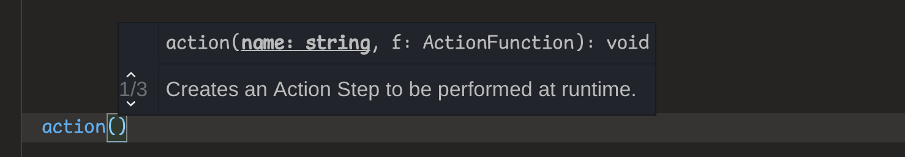
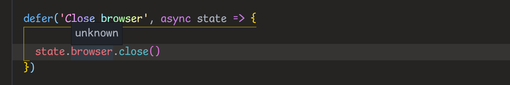
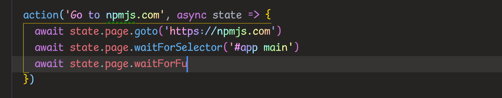

# VS Code JavaScript IntelliSense and/or TypeScript Support

Out of the box, **prescript** comes with a type declaration file. This means it
will work with
[VS Code IntelliSense for JavaScript](https://code.visualstudio.com/docs/languages/javascript)
right away, even if you are using just JavaScript.



## Declaring the type of prescript `state`

The type of `state` variable, passed to your action functions in `action()` and
`defer()` APIs defaults to an `unknown` type.



That means that by default you don’t get autocompletion when writing actions:



To fix this, you can define the type of your prescript `state` by following
these steps:

1.  If you are not using TypeScript,
    [set up a JavaScript project in VS Code](https://code.visualstudio.com/docs/languages/javascript#_javascript-projects-jsconfigjson)
    by creating a `jsconfig.json` file at the root of your project.

    ```json
    {
      "compilerOptions": { "target": "ES6" },
      "exclude": ["node_modules", "**/node_modules/*"]
    }
    ```

    Reload VS Code after creating this file to make sure that VS Code picks up
    the configuration file.

2.  Create a file `state.d.ts` which will contain the type definition of your
    state. Here’s an example:

    ```typescript
    import * as puppeteer from 'puppeteer'

    declare namespace Prescript {
      interface GlobalState {
        browser: puppeteer.Browser
        page: puppeteer.Page
      }
    }
    ```

    Anything you add to the `GlobalState` interface inside `Prescript` namespace
    will show up in the type of the `state` variable.
