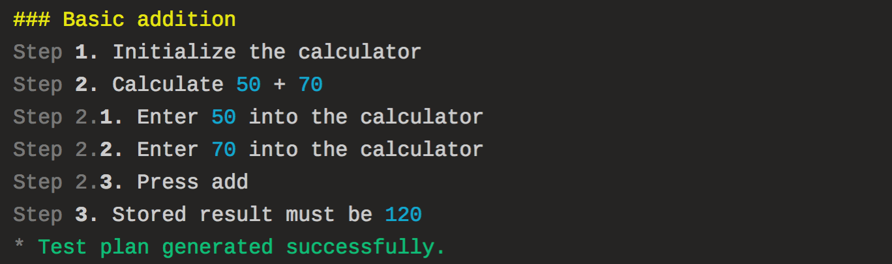

# Writing tests in prescript

## Conceptual model

In prescript, your **“test”** (scenario) is separated into multiple discrete
**“steps”.** This results in a **“test plan”** which looks like this:

```text
Test: Sucessful password reset
├── Step 1. Open browser
├── Deferred Step 2. Close browser
├── Step 3. Request password reset
│   ├── Step 3.1. Go to forgot password page
│   ├── Step 3.2. Enter the email
│   └── Step 3.3. Submit the form
├── Step 4. Open the password reset link in email
│   ├── Step 4.1. Check the email
│   ├── Step 4.2. Open the reset password email
│   └── Step 4.3. Click the reset password link in email
├── Step 5. Reset password
│   ├── Step 5.1. Enter the new password
│   └── Step 5.2. Submit the form
├── Step 6. Login with the new credentials
└── Step 7. I should be in the workspace
```

There are **4 types of steps**:

* **Action steps** performs some kind of action. If an action fail, all
  subsequent steps will be aborted.
* **Deferred steps** queues an action to be run at the end of the test. It will
  be run when the test is completed or terminated due to an error in one of the
  action steps.
* **Composite steps** can contain child steps.
* **Pending steps** marks the test as pending. Its behavior is equivalent to a
  failed action step (that is, it aborts the tests and future steps are not
  run). But instead of the test being marked as “FAILED” (exit code 1), it will
  be marked as “PENDING” (exit code 2). This is useful when your test is not
  complete, or when (temporarily) disabling a test.

## Programming model

We write our test in JavaScript. The above test can be represented in
**prescript** as JavaScript code like this:

<!-- prettier-ignore-start -->
```js
const { test, to, action, defer } = require('prescript')
test('Sucessful password reset', () => {
  action('Open browser', async state => { ... })
  defer('Close browser', async state => { ... })
  to('Request password reset', () => {
    action('Go to forgot password page', async state => { ... })
    action('Enter the email', async state => { ... })
    action('Submit the form', async state => { ... })
  })
  to('Open the password reset link in email', () => {
    action('Check the email', async state => { ... })
    action('Open the reset password email', async state => { ... })
    action('Click the reset password link in email', async state => { ... })
  })
  to('Reset password', () => {
    action('Enter the new password', async state => { ... })
    action('Submit the form', async state => { ... })
  })
  action('Login with the new credentials', () => { ... })
  action('I should be in the workspace', () => { ... })
})
```
<!-- prettier-ignore-end -->

Since the test file is a JavaScript file, you can also generate actions
indirectly (see the Page Object section down below for an example).

## Execution phases

When you run **prescript**, there are 2 phases that your code gets executed:

* **Prescripting phase.** In this phase, your test code is first executed to
  determine what tests are available, including the steps in each test. This
  results in a **test plan** being generated. Code outside the `action()` and
  `defer()` blocks are executed in this phase.

  ::: warning

  All the logic that’s executed during the prescripting phase **must be
  deterministic** to allow the test code to be safely hot-reloaded.

  :::

* **Running phase.** In this phase, prescript executes the actions according to
  the test plan generated from the prescripting phase.

## A basic test

Use `test()` to define a test. Each test must have a unique name.

Use `action()` to create an **action step**. You should pass a function that
either returns a Promise \(async action\) or returns nothing \(sync action\).

```javascript
// Basic addition.js
const { test, to, action } = require('prescript')
const assert = require('assert')
const Calculator = require('../lib/Calculator')

test('Basic addition', () => {
  action('Initialize the calculator', state => {
    state.calculator = new Calculator()
  })
  action('Enter 50 into the calculator', state => {
    state.calculator.enter(50)
  })
  action('Enter 70 into the calculator', state => {
    state.calculator.enter(70)
  })
  action('Press add', state => {
    state.calculator.add()
  })
  action('Stored result must be 120', state => {
    assert.equal(state.calculator.result, 120)
  })
})
```

## Use composite steps to group related steps together

Multiple actions may be grouped using `to()`. This creates a **composite step.**

```js
// Basic addition.js
test('Basic addition', () => {
  action('Initialize the calculator', state => {
    state.calculator = new Calculator()
  })
  to('Calculate 50 + 70', () => {
    action('Enter 50 into the calculator', state => {
      state.calculator.enter(50)
    })
    action('Enter 70 into the calculator', state => {
      state.calculator.enter(70)
    })
    action('Press add', state => {
      state.calculator.add()
    })
  })
  action('Stored result must be 120', state => {
    assert.equal(state.calculator.result, 120)
  })
})
```

## Use [page object pattern](http://martinfowler.com/bliki/PageObject.html) for more fluent and maintainable tests

Upgrading to this pattern is very beneficial when there are many test cases that
reuses the same logic.

For more, I highly recommend reading
[_Selenium: 7 Things You Need To Know_](https://www.lucidchart.com/techblog/2015/07/21/selenium-7-things-you-need-to-know-2/),
even for people who don’t use Selenium. The article contains a lot of great tips
for anyone who writes end-to-end tests. And these tips applies even if you’re
using something else (e.g. Puppeteer, Appium, etc) to test your app.

In this pattern, **instead of creating steps directly in our test code,** we
write a library that creates the test steps for us.

Here’s the previous test case, using the page object pattern.

```javascript
// Basic addition.js
const { test } = require('prescript')
const CalculatorTester = require('../test-lib/CalculatorTester')

test('Basic addition', () => {
  new CalculatorTester().add(50, 70).resultMustBe(120)
})
```

**Now our test is much shorter.** All of our logic related to controlling the
calculator is now centralized in `CalculatorTester`. This means
`CalculatorTester` can be used from many tests, leading to a drier code.

```javascript
// CalculatorTester.js
const { to, action } = require('prescript')
const Calculator = require('../lib/Calculator')
const assert = require('assert')

module.exports = class CalculatorTester {
  constructor() {
    action('Initialize the calculator', state => {
      state.calculator = new Calculator()
    })
  }

  /**
   * Creates a step that makes the calculator add `a` and `b` together.
   * @param {number} a
   * @param {number} b
   */
  add(a, b) {
    to`Calculate ${a} + ${b}`(() => {
      this.enter(a)
        .enter(b)
        .pressAdd()
    })
    return this
  }

  /**
   * Creates a step that asserts the state of the calculator.
   * @param {number} n
   */
  resultMustBe(n) {
    action`Stored result must be ${n}`(state => {
      assert.equal(state.calculator.result, n)
    })
    return this
  }

  /**
   * Creates a step that enters a number into the calculator.
   * @param {number} number
   */
  enter(number) {
    action`Enter ${number} into the calculator`(state => {
      state.calculator.enter(number)
    })
    return this
  }

  /**
   * Creates a step that presses the add button on the calculator.
   * @param {number} number
   */
  pressAdd() {
    action('Press add', state => {
      state.calculator.add()
    })
    return this
  }
}
```

::: tip THE TAGGED TEMPLATE LITERAL SYNTAX

When creating steps that involves variables, you can use a
[**tagged template literals**](http://exploringjs.com/es6/ch_template-literals.html)
syntax, as can be seen in the example above:

<!-- prettier-ignore-start -->
```js
    action`Stored result must be ${n}`(state => {
      assert.equal(state.calculator.result, n)
    })
```
<!-- prettier-ignore-end -->

When run, the substitutions (`${n}`) will be color-coded. This is an indication
that suggests you not to use the substituted text when search the source code
for the step you want.



:::
